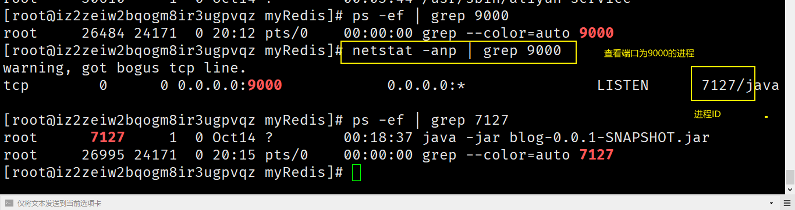
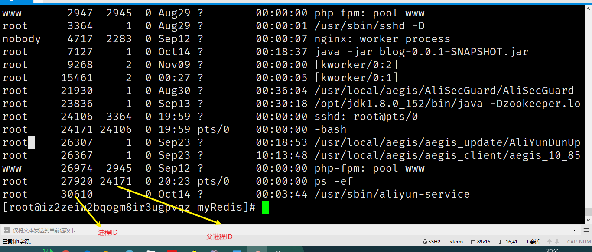

### 常用的命令

帮助命令

```
man cd
cd --help
```

文件目录命令

```
touch hello.txt
vim hello.txt
mkdir aa

// 文件全部显示出来
cat hello.txt
// 一页
more hello.txt
less hello.txt

// 显示更多的信息
ls -l
//隐藏的文件也会显示出来
ls -a 
ls 

cp hello.txt copy.txt
mv hello.txt a.txt
mv hello.txt ../

// 删除文件
rm -rvf a.txt 

cd /mnt
pwd


// 统计字数
wc a.txt

chmod 777 hello.txt
```

ipcs -m

ipcs -m [shmid]


top命令:系统资源使用状况

```
top - 　　　　系统当前时间
up 　　　　　 系统已开机多长时间
user 　　　　 当前用户数
load average cpu平均负载，三个数值分别为，1分钟，5分钟，15分钟
Tasks 　　 系统当前进程数，total：总进程数，running：正在运行的进程数，sleeping：睡眠的进程数，stopped：停止的进程数，zombie：僵尸进程数
%Cpu(s) cpu使用率，us：用户使用cpu百分百，sy：系统内核使用cpu百分百，id：剩余的cpu百分百
Mem 　　　 内存使用信息，total：总内存大小，free：空闲的内存，used：已使用的内存，buff/cache：缓存的内存大小
Swap 　　 虚拟内存信息
PID　　　　 进程id
USER　　　　 进程所有者
PR　　　　　　 优先级
NI　　　　　　　nice值，负值表示高优先级，正值表示低优先级
VIRT 　　　　　 进程使用的虚拟内存总量
RES 　　　　　 进程使用的物理内存大小
SHR 　　　　　 共享内存大小
S 　　　　　　 进程状态，D：不可中断的睡眠状态，R：运行，S：睡眠，T：跟踪/停止，Z：僵尸进程
%CPU 　　　　 进程使用的CPU占用百分比
%MEM 　　　　 进程使用的物理内存百分比
TIME+ 　　　　 进程使用的CPU时间总计
COMMAND　　 命令名
```


```shell
kill -9 9000
// 查看进程
ps -ef
// 查看网络情况
netstat -anp 
netstat -anp | grep 9000   // 查看端口号为9000的进程
```






