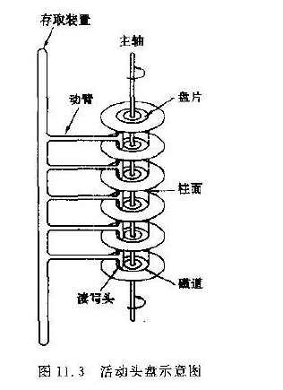

## MySQL

### 1.索引

#### 1.1磁盘

计算机的存储设备分为俩种：内存储器和外存储器

内存储器：存储容量小，价格低，断电数据会消失

外存储器：存储容量大，价格高，断电数据不会消失

##### 1.1.1磁盘构造

​		磁盘类似于光盘形状的圆盘，盘面上有圆圈的磁道，数据记录在磁道上。磁盘可以是单片也可以是多片。上图所示就是多片（6片)，磁盘的俩面都可以存储数据，除了最顶端和最低端的外侧面不可以存储数据，其余都可以存储。

​		磁盘驱动器工作时，盘片装在主轴上，并绕主轴告诉旋转，当磁道在读/写头（磁头）下通过是即可读写数据。磁盘可以分为固定头盘和活动头盘，固定头盘每一个磁道都有磁头，他是固定不动的，专门负责某一磁道的数据读写。