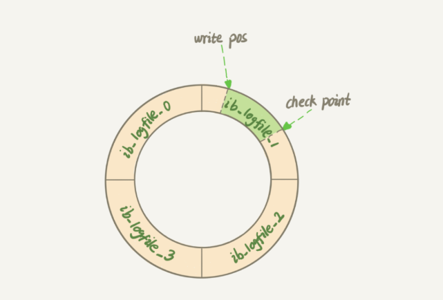

## MySQL

### 1.三范式

降低了数据的冗余

查询效率更高

### 2三种日志

binlog

redolog

undolog

#### binlog和redolog区别

- binlog是server层，redolog是innodb存储引擎特有的；
- binlog是逻辑层面的，记录的是更新了表中的那条数据，redolog记录的是对数据页的修改；
- binlog文件是追加的，redolog文件是循环写的，有俩个指针write pos:当前写的位置， check point：察除的位置

