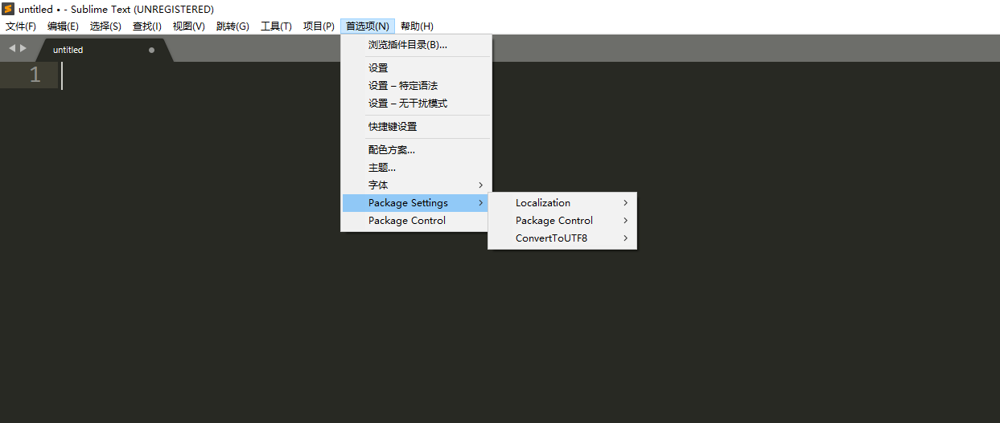

## Win10


------

### win10使用

#### 快捷键

*按住SHIF在点击鼠标左键选择第一个文件和最后一个文件，即可选择该范围的文件*

*CTRL+A选择全部文件*


#### 修改默认下载位置


------


### 2.应用程序exe

#### 2.1chrome

##### 2.1.1任务栏变白


```
taskkill /f /im explorer.exe

attrib -h -i %userprofile%\APPData\local\Iconcache.db

del %userprofile%\AppData\Local\IconCache.db /a

start explorer
```

> 后缀为bat文件，运行它即可。

##### 2.1.2SurfingKeys

> ALT+S:开启

> og:谷歌搜索
>
> ob：百度搜索 
>
> gg：最上面
>
> G：最下面
>
> yy:复制当前url
>
> i：选择输入框

#### 2.2QTTabBar

###### 2.2.1 快捷键

 *ALT+X	复制文件夹名*

 *ALT+C	复制文件夹路径*

 *CTRL+SHIFT+X	复制文件名*

 *CTRL+SHIFT+C	复制文件路径*


*CLTR+1	切换第一个标签*

*CTRL+2	切换第二个标签*

*CTRL+LEFT	切换最左边标签s*

*CTRL+RIGHT	切换最右边标签*


 *CTRL+N	克隆一个标签*

 *CTRL+W	关闭一个标签*

 *CTRL+SHIFT+W	关闭其他标签*

#### 2.3sublime

##### 2.3.1 配色方案


##### 2.3.2.插件

###### pac

①安装package controll


②输入pac,选择install package controll回车即可


###### 插件

convert to utf-8

chinese :中文





##### 3.更改插件目录的位置

​	原目录删除，在安装目录下建立Data文件夹即可。


#### 3.翻译软件

​	


设置：如图所示打开，点击专注模式即可。


### 4.markdown

#### 1.输入空格

①使用 &emsp；来打出空格，注意最后一个分号是英文格式，此处为中文格式。

②使用全角的空格。这种方法需要设置输入法。我使用的搜狗输入法，需要在输入法上右键点入属性设置，开启shift+space的快捷键才可切换至全角。英文格式+(SHIFT+SPACE)

*推荐使用方式②*

　　helloword

&emsp;&emsp;helloword

　　