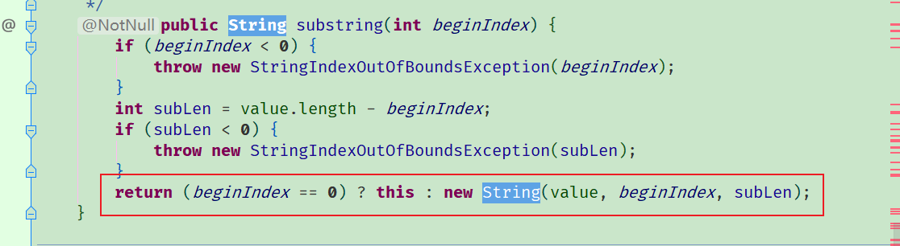

## Java基础

### 1Java不可变性如何理解？

​	在java中类是不可变的，对象的不可变是在创建对象后不可以修改该对象的状态，即它的成员变量不能发生改变，基本数据类型的不可以发生改变，引用类型的变量不可以指向其他对象。

```java
String str = "helloword";
str = "hey"; // 对象并没发生改变，只是重新创建了一个对象
```

str:对象的引用,对象的地址，不是真正的对象，真正的对象存放在它所指向的地址

java不可以直接操作对象本身，通过对象引用访问对象，调用对象的方法操作对象，C++是可以直接操作对象本身，虽然java的对象引用和c++的指针都是存放对象的地址，但是java的对象引用失去部分灵活性，不能像c++那样进行加减运算。


jdk1.6

```java
public final class String
    implements java.io.Serializable, Comparable<String>, CharSequence
{
    /** The value is used for character storage. */
    private final char value[];
 
    /** The offset is the first index of the storage that is used. */
    private final int offset;
 
    /** The count is the number of characters in the String. */
    private final int count;
 
    /** Cache the hash code for the string */
    private int hash; // Default to 0
```

jdk1.7

```java
public final class String
    implements java.io.Serializable, Comparable<String>, CharSequence {
    /** The value is used for character storage. */
    private final char value[];
 
    /** Cache the hash code for the string */
    private int hash; // Default to 0
```

这些成员变量都是private修饰，没有提供相应的set方法



可以看出value发生改变时都会创建一个新的字符串对象


我们可以通过反射改变字符串对象的value值,虽然说value所指向的数组无法重新指向其他对象，但是我们可以通过反射改变它所指向的字符数组的值。

```java
public static void main(String[] args) throws Exception {

        String str = "abc";
        Field values = String.class.getDeclaredField("value");
        values.setAccessible(true);
        char[] strArr = (char[])(values.get(str));
        strArr[0]='3';
        System.out.println(str);

    }
```

