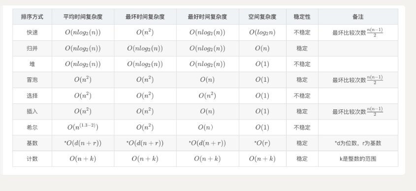

### 排序




#### 快速排序

快速排序把内容分为俩部分第一部分都小于第二部分，然后递归

如果每次分的一部分是一个数那么就退化为n^2,和冒泡排序一样了

已经递增了就会出现这种情况

```java
public void swap(int[] arr,int i,int j) {
        if (i == j) {
            return;
        }
        arr[i] = arr[i] ^ arr[j];
        arr[j] = arr[i] ^ arr[j];
        arr[i] = arr[i] ^ arr[j];
    }
    
    public void quickSort(int[] arr) {
        quickSort(arr,0,arr.length-1);
    }
    
      public void quickSort(int[] arr,int l,int r) {
          if (l < r) {
              // 随机数
              int random = (int)Math.random()*(r-l+1) + l;
              swap(arr,random,r);
              int[] paration = paration(arr,l,r);
              quickSort(arr,l,paration[0]);
              quickSort(arr,paration[1],r);
          }
      }
    
    public int[] paration(int[] arr, int l, int r) {
        
        int less  = l - 1;
        int more = r;
        while (l < more) {
            if (arr[l] < arr[r]) {
                swap(arr,++less,l++);
            } else if (arr[l] > arr[r]){
                swap(arr, l, --more);
            } else {
                l++;
            }
        }
        return new int[]{less,more+1};
    }
```

#### 堆排序

```java
public void heapSort(int[] arr) {
        
        int size = arr.length;
        for (int i = 1; i < size; i++) {
            heapInsert(arr,i);
        }
       
        while (--size > 0) {
            swap(arr,0,size);
            heapify(arr,size);
        }
    }
    
    public void heapInsert(int[] arr,int i) {
        
       while (arr[i] > arr[(i-1)/2]){
           swap(arr,i,(i-1)/2);
           i = (i-1)/2;
       }
    }
                           
     public void heapify(int[] arr,int size) {
         int cur  = 0;
         int left = 2 * cur + 1;
         
         while (left < size) {
             int max = (left + 1 < size && arr[left] < arr[left + 1] )? left + 1 : left;
             max = arr[max] < arr[cur] ? cur : max;
             if (max == cur) {
                 return;
             }
             swap(arr,cur,max);
             cur = max;
             left = 2 * cur + 1;
         }
     }                      
                           
    public void swap(int[] arr,int i,int j) {
        if (i== j) {
            return;
        }
        arr[i] = arr[i] ^ arr[j];
        arr[j] =arr[i] ^ arr[j];
        arr[i] = arr[i] ^ arr[j];
    }
  
```

#### 归并排序

```java
public void mergeSort(int[] arr) {
        mergeSort(arr,0,arr.length-1);
    }
    
    public void mergeSort(int[] arr,int l,int r) {
        if (l < r) {
            int mid = l + (r - l) / 2;
            mergeSort(arr,l,mid);
            mergeSort(arr,mid+1,r);
            merge(arr,l,mid,r);
        }
    }
    
    public void merge(int[] arr, int l, int mid, int r) {
        int[] help = new int[r - l + 1];
        int p1 = l;
        int p2 = mid + 1;
        int i =0;
        while (p1 <= mid && p2 <= r){
            help[i++] = arr[p1] < arr[p2] ? arr[p1++] : arr[p2++];
        }
        while (p1 <= mid) {
            help[i++] = arr[p1++];
        }
        while (p2 <= r) {
            help[i++] = arr[p2++];
        }
        
        for (i = 0 ; i < help.length; i++) {
            arr[l + i] = help[i];
        }
    }
```


#### 冒泡排序

```java
  // 冒泡排序
    public void bubbleSort(int[] arr) {
        for (int i = 0; i < arr.length  - 1; i++) {
            for (int j = 0; j < arr.length - 1 - i; j++) {
                if (arr[j] > arr[j + 1]) {
                    swap(arr,j,j+1);
                }
            }
        }
    }
```

```java
public void bubbleSort(int[] arr) {
    boolean status = false;
    for(int i = 0; i < arr.length -1; i++) {
         for (int j = 0; j < arr.length -1 - i; j++) {
            if (arr[j] > arr[j + 1]) {
                status = true;
                swap(arr, j, j + 1);
            }
        }
        if (status) {
            return;
        }
    }
}
```

改进后所以最好时间复杂度为o(n)

### 二分查找

#### [二分查找](https://www.nowcoder.com/practice/7bc4a1c7c371425d9faa9d1b511fe193?tpId=190&&tqId=35227&rp=1&ru=/ta/job-code-high-rd&qru=/ta/job-code-high-rd/question-ranking)

　　请实现有重复数字的有序数组的二分查找。输出在数组中第一个大于等于查找值的位置，如果数组中不存在这样的数，则输出数组长度加一。


```java
import java.util.*;


public class Solution {
    /**
     * 二分
     查找
     * @param n int整型 数组长度
     * @param v int整型 查找值
     * @param a int整型一维数组 有序数组
     * @return int整型
     */
    public int upper_bound_ (int n, int v, int[] a) {
        // write code here
       if (n == 0){
           return 1;
       }
          
        int l = 0;
        int r = n - 1;
        while (l <= r) {
            int mid = l + (r - l) / 2;
            if (a[mid] >= v) {
                if (mid ==0  || a[mid-1] < v){
                    return mid + 1;
                } else {
                    r = mid - 1;
                }
            } else {
                l = mid + 1;
            }
            
        }
        return n + 1;
    }
}
```

#### [69. x 的平方根](https://leetcode-cn.com/problems/sqrtx/)

难度简单531

实现 `int sqrt(int x)` 函数。

计算并返回 *x* 的平方根，其中 *x* 是非负整数。

由于返回类型是整数，结果只保留整数的部分，小数部分将被舍去。

**示例 1:**

```
输入: 4
输出: 2
```

**示例 2:**

```
输入: 8
输出: 2
说明: 8 的平方根是 2.82842..., 
     由于返回类型是整数，小数部分将被舍去。
```

通过次数219,938

提交次数565,164


```
l + (r - l + 1)/2 : 比如3和4不取右中就无法退出
```


```java
class Solution {
    public int mySqrt(int x) {
        if (x == 0) {
            return 0;
        }
        long l = 1;
        long r = x/2;
        while (l < r) {
            long mid = l + (r -l + 1)/2;
            long res = mid * mid;
            if (res > x) {
                r = mid - 1;
            } else {
                l = mid;
            }
        }
        return (int)l;
    }
}
```


#### [35. 搜索插入位置](https://leetcode-cn.com/problems/search-insert-position/)


难度简单724

给定一个排序数组和一个目标值，在数组中找到目标值，并返回其索引。如果目标值不存在于数组中，返回它将会被按顺序插入的位置。

你可以假设数组中无重复元素。

**示例 1:**

```
输入: [1,3,5,6], 5
输出: 2
```

**示例 2:**

```
输入: [1,3,5,6], 2
输出: 1
```

**示例 3:**

```
输入: [1,3,5,6], 7
输出: 4
```

**示例 4:**

```
输入: [1,3,5,6], 0
输出: 0
```

```
假设默认比所有都大，放在最后面，如果一个>=它,则选择该位置,
《无法确定目标值是否大于该值还是等于该值，所以无法处理
```


```java
class Solution {
    public int searchInsert(int[] nums, int target) {
        int l = 0;
        int r = nums.length - 1;
        int ans = nums.length;
        while (l <= r) {
            int mid = l + (r - l) / 2;
            if (nums[mid] >= target) {
                
                // 可以取到最后
                ans = mid;
                r = mid-1;
            } else {
                
                l = mid + 1;
            }
        }
        return ans;
    }
}
```


#### [剑指 Offer 59 - I. 滑动窗口的最大值](https://leetcode-cn.com/problems/hua-dong-chuang-kou-de-zui-da-zhi-lcof/)

难度简单140

给定一个数组 `nums` 和滑动窗口的大小 `k`，请找出所有滑动窗口里的最大值。

**示例:**

```
输入: nums = [1,3,-1,-3,5,3,6,7], 和 k = 3
输出: [3,3,5,5,6,7] 
解释: 

  滑动窗口的位置                最大值
---------------               -----
[1  3  -1] -3  5  3  6  7       3
 1 [3  -1  -3] 5  3  6  7       3
 1  3 [-1  -3  5] 3  6  7       5
 1  3  -1 [-3  5  3] 6  7       5
 1  3  -1  -3 [5  3  6] 7       6
 1  3  -1  -3  5 [3  6  7]      7
```

 

**提示：**

你可以假设 *k* 总是有效的，在输入数组不为空的情况下，1 ≤ k ≤ 输入数组的大小。

注意：本题与主站 239 题相同


```java
class Solution {
    public int[] maxSlidingWindow(int[] nums, int k) {

        if (nums == null || nums.length == 0 ||nums.length < k) {
            return new int[]{};
        }

        int n = nums.length;
        int[] res = new int[n - k + 1];
        int index = 0;
        Deque<Integer> deque = new LinkedList<>();
        for (int i = 1 - k,j = 0;i <= n - k && j <= n-1;i++,j++) {
            if (i >= 1 && deque.peekFirst() == nums[i - 1]) {
                deque.removeFirst();
            }
            while (!deque.isEmpty() && deque.peekLast() < nums[j]) {
                deque.removeLast();
            }
            deque.addLast(nums[j]);
            if (i >= 0){
                res[index++] = deque.peekFirst();
            }
            
        }
        return res;
    }
}
```


#### [剑指 Offer 48. 最长不含重复字符的子字符串](https://leetcode-cn.com/problems/zui-chang-bu-han-zhong-fu-zi-fu-de-zi-zi-fu-chuan-lcof/)

难度中等111

请从字符串中找出一个最长的不包含重复字符的子字符串，计算该最长子字符串的长度。

 

**示例 1:**

```
输入: "abcabcbb"
输出: 3 
解释: 因为无重复字符的最长子串是 "abc"，所以其长度为 3。
```

**示例 2:**

```
输入: "bbbbb"
输出: 1
解释: 因为无重复字符的最长子串是 "b"，所以其长度为 1。
```

**示例 3:**

```
输入: "pwwkew"
输出: 3
解释: 因为无重复字符的最长子串是 "wke"，所以其长度为 3。
     请注意，你的答案必须是 子串 的长度，"pwke" 是一个子序列，不是子串。
```


```java
class Solution {
    public int lengthOfLongestSubstring(String s) {
        int l = 0;
        int res = 0;
        int r = 0;
        Set<Character> set = new HashSet<>();
        for (char ch : s.toCharArray()) {
            while (set.contains(ch)){
                set.remove(s.charAt(l++));
            }
            set.add(ch);
            r++;
            res = Math.max(res, r - l);
        }
        return res;
    }
}
```

### 数组

#### [88. 合并两个有序数组](https://leetcode-cn.com/problems/merge-sorted-array/)

难度简单675

给你两个有序整数数组 *nums1* 和 *nums2*，请你将 *nums2* 合并到 *nums1* 中*，*使 *nums1* 成为一个有序数组。

 

**说明：**

- 初始化 *nums1* 和 *nums2* 的元素数量分别为 *m* 和 *n* 。
- 你可以假设 *nums1* 有足够的空间（空间大小大于或等于 *m + n*）来保存 *nums2* 中的元素。

 

**示例：**

```
输入：
nums1 = [1,2,3,0,0,0], m = 3
nums2 = [2,5,6],       n = 3

输出：[1,2,2,3,5,6]
```

```java
class Solution {
    public void merge(int[] nums1, int m, int[] nums2, int n) {
       
        int max = Math.max(m,n);
        int[] tempNums1 = new int[m];
        System.arraycopy(nums1,0,tempNums1,0,m);
        int i = 0;
        int j = 0;
        int index = 0;
        while (i < m && j < n) {
            nums1[index++] = tempNums1[i] <= nums2[j] ? tempNums1[i++] : nums2[j++];
        }
        if (i < m) {
            
            System.arraycopy(tempNums1,i,nums1,index,m-i);
        }
        if (j < n) {
            System.arraycopy(nums2,j,nums1,index,n-j);
        }
        
    }
}
```

```java
class Solution {
    public void merge(int[] nums1, int m, int[] nums2, int n) {
        int p1 = m -1;
        int p2 = n -1;
        int p = m + n -1;
        while ( p1 >= 0 && p2 >= 0) {
            nums1[p--] = nums1[p1] > nums2[p2] ? nums1[p1--] : nums2[p2--];
        }
        System.arraycopy(nums2,0,nums1,0,p2+1);
    }
}
```

#### [剑指 Offer 39. 数组中出现次数超过一半的数字](https://leetcode-cn.com/problems/shu-zu-zhong-chu-xian-ci-shu-chao-guo-yi-ban-de-shu-zi-lcof/)

难度简单85

数组中有一个数字出现的次数超过数组长度的一半，请找出这个数字。

 

你可以假设数组是非空的，并且给定的数组总是存在多数元素。

 

**示例 1:**

```
输入: [1, 2, 3, 2, 2, 2, 5, 4, 2]
输出: 2
```

##### 摩尔计数法

```java
class Solution {
    public int majorityElement(int[] nums) {
        int votes = 0;
        int x = 0;
        for (int num : nums) {
            if (votes == 0) {
                x = num;
                votes = 1;
            } else {
                votes += (x == num) ? 1 : -1;
            }
            
        }

        int count = 0;
        for (int num : nums) {
            if (x == num) {
                count++;
            }
        }
        if (count <= nums.length / 2){
            x= 0;
        }

        return x;
    }
}
```

#### [695. 岛屿的最大面积](https://leetcode-cn.com/problems/max-area-of-island/)

难度中等383

给定一个包含了一些 `0` 和 `1` 的非空二维数组 `grid` 。

一个 **岛屿** 是由一些相邻的 `1` (代表土地) 构成的组合，这里的「相邻」要求两个 `1` 必须在水平或者竖直方向上相邻。你可以假设 `grid` 的四个边缘都被 `0`（代表水）包围着。

找到给定的二维数组中最大的岛屿面积。(如果没有岛屿，则返回面积为 `0` 。)

 

**示例 1:**

```
[[0,0,1,0,0,0,0,1,0,0,0,0,0],
 [0,0,0,0,0,0,0,1,1,1,0,0,0],
 [0,1,1,0,1,0,0,0,0,0,0,0,0],
 [0,1,0,0,1,1,0,0,1,0,1,0,0],
 [0,1,0,0,1,1,0,0,1,1,1,0,0],
 [0,0,0,0,0,0,0,0,0,0,1,0,0],
 [0,0,0,0,0,0,0,1,1,1,0,0,0],
 [0,0,0,0,0,0,0,1,1,0,0,0,0]]
```

对于上面这个给定矩阵应返回 `6`。注意答案不应该是 `11` ，因为岛屿只能包含水平或垂直的四个方向的 `1` 。

**示例 2:**

```
[[0,0,0,0,0,0,0,0]]
```

对于上面这个给定的矩阵, 返回 `0`。

 

**注意:** 给定的矩阵`grid` 的长度和宽度都不超过 50。


```java
class Solution {

    int m;
    int n;
    int[][] direction = {{0,1}, {1,0}, {0,-1}, {-1,0}};
    public int maxAreaOfIsland(int[][] grid) {
        if (grid == null || grid.length == 0) {
            return 0;
        }
        m = grid.length;
        n = grid[0].length;
        int maxArea = 0;
        for (int i = 0; i < m; i++) {
            for (int j = 0; j < n; j++) {
                maxArea = Math.max(maxArea,dfs(grid,i,j));
            }
        }
        return maxArea;
    }

    public int dfs(int[][] grid, int i, int j) {
        if (i >= m || i < 0 || j >=n || j < 0 || grid[i][j] == 0){
            return 0;
        }
        grid[i][j] = 0;
        int area = 1;
        for(int[] d : direction) {
            area += dfs(grid,i+d[0],j+d[1]);
        }
        return area;
    }
}
```

#### [42. 接雨水](https://leetcode-cn.com/problems/trapping-rain-water/)

难度困难1792

给定 *n* 个非负整数表示每个宽度为 1 的柱子的高度图，计算按此排列的柱子，下雨之后能接多少雨水。

 

**示例 1：**


```
输入：height = [0,1,0,2,1,0,1,3,2,1,2,1]
输出：6
解释：上面是由数组 [0,1,0,2,1,0,1,3,2,1,2,1] 表示的高度图，在这种情况下，可以接 6 个单位的雨水（蓝色部分表示雨水）。 
```

**示例 2：**

```
输入：height = [4,2,0,3,2,5]
输出：9
```

 

**提示：**

- `n == height.length`
- `0 <= n <= 3 * 104`
- `0 <= height[i] <= 105`

通过次数161,940

提交次数305,661


##### code

//动态规划

```java
class Solution {
    public int trap(int[] height) {
        if (height == null || height.length == 0) {
            return 0;
        }
        int[] leftMax = new int[height.length];
        
        leftMax[0] = height[0];
        for (int i = 1; i < height.length; i++) {
            leftMax[i] = Math.max(leftMax[i-1], height[i]);
        }
        int[] rightMax = new int[height.length];
        rightMax[height.length - 1] = height[height.length - 1];
        for (int i = height.length - 2; i >= 0; i--) {
            rightMax[i] = Math.max(rightMax[i+1], height[i]);
        }
        int len = height.length;
        int ans = 0;
        for (int i = 1; i < len; i++) {
            ans += (Math.min(leftMax[i],rightMax[i]) - height[i]);
        }
        return ans;
    }
}
```

```java
// 优化 如果左边小于右边面积的计算依赖于左边反之右边
class Solution {
    public int trap(int[] height) {

        if (height == null || height.length == 0) {
            return 0;
        }

        int len = height.length;
        int ans = 0;
        int leftMax = 0;
        int rightMax = 0;
        int left = 0;
        int right = len -1;

        while (left <= right) {
            if(height[left] < height[right]) {
                if (height[left] >= leftMax) {
                    leftMax = height[left];
                } else {
                    ans += (leftMax - height[left]);
                    
                }
                left++;
            } else {
                if (height[right] >= rightMax) {
                    rightMax = height[right];
                } else {
                    ans += (rightMax - height[right]);
                    
                }
                right--;
            }
        }
        return ans;
    }
}
```


#### [54. 螺旋矩阵](https://leetcode-cn.com/problems/spiral-matrix/)

难度中等530

给定一个包含 *m* x *n* 个元素的矩阵（*m* 行, *n* 列），请按照顺时针螺旋顺序，返回矩阵中的所有元素。

**示例 1:**

```
输入:
[
 [ 1, 2, 3 ],
 [ 4, 5, 6 ],
 [ 7, 8, 9 ]
]
输出: [1,2,3,6,9,8,7,4,5]
```

**示例 2:**

```
输入:
[
  [1, 2, 3, 4],
  [5, 6, 7, 8],
  [9,10,11,12]
]
输出: [1,2,3,4,8,12,11,10,9,5,6,7]
```

##### code

```java
class Solution {

    int[][] directions = {{0,1}, {1,0}, {-1,0}, {0,-1}};
    int directionIndex = 0;
    int m;
    int n;
    public List<Integer> spiralOrder(int[][] matrix) {
        if (matrix == null || matrix.length == 0) {
            return new ArrayList<Integer>();
        }
        
        m = matrix.length;
        n = matrix[0].length;
        boolean[][] visited = new boolean[m][n];
        int total = m * n;
        int row = 0;
        int column = 0;
        List<Integer> res = new ArrayList<>();
        
        for (int i = 0; i < total; i++) {
            res.add(matrix[row][column]);
            visited[row][column] = true;
            int nextRow = row + directions[directionIndex][0];
            int nextColumn = column + directions[directionIndex][1];
            if (nextRow < 0 || nextRow >= m || nextColumn < 0 || 
                nextColumn >=n || visited[nextRow][nextColumn]){
                directionIndex = (directionIndex + 1) % 4; 
            }
            row += directions[directionIndex][0];
            column += directions[directionIndex][1];
        }
        return res;
      }
}
```


### 链表

#### [206. 反转链表](https://leetcode-cn.com/problems/reverse-linked-list/)

难度简单1315

反转一个单链表。

**示例:**

```
输入: 1->2->3->4->5->NULL
输出: 5->4->3->2->1->NULL
```

**进阶:**
你可以迭代或递归地反转链表。你能否用两种方法解决这道题？


##### code

```java
class Solution {
    public ListNode reverseList(ListNode head) {
        ListNode curr = head;
        ListNode pre = null;
        ListNode next = null;
        if (curr == null) {
            return null;
        }
        while(curr != null) {
            next = curr.next;
            curr.next = pre;
            pre = curr;
            curr = next;
        }
        return pre;
    }
}
```

```java
class Solution {
    public ListNode reverseList(ListNode head) {
        if (head == null || head.next == null) {
            return head;
        }
        ListNode res = reverseList(head.next);
        // 由于head和它next并未发生变化
        head.next.next = head;
        // 这里忘记写了，会产生环形链表
        head.next = null;
        return res;
    }
}
```


#### [234. 回文链表](https://leetcode-cn.com/problems/palindrome-linked-list/)

难度简单754

请判断一个链表是否为回文链表。

**示例 1:**

```
输入: 1->2
输出: false
```

**示例 2:**

```
输入: 1->2->2->1
输出: true
```

##### code

```java
class Solution {
    private ListNode frontPointer;
    public boolean isPalindrome(ListNode head) {
        frontPointer = head;
        return recursivelyCheck(head);
    }

    public boolean recursivelyCheck(ListNode currNode) {
        if (currNode == null) {
            return true;
        }
        if (!recursivelyCheck(currNode.next)) {
            return false;
        }
        if(frontPointer.val != currNode.val) {
            return false;
        }
        frontPointer = frontPointer.next;
        return true;
    }
}
```

该进

```java
class Solution {
    private ListNode frontPointer;
    public boolean isPalindrome(ListNode head) {
        frontPointer = head;
        return recursivelyCheck(head);
    }

    public boolean recursivelyCheck(ListNode currNode) {
        if (currNode != null) {
            if (!recursivelyCheck(currNode.next)) {
            return false;
            }
            if (frontPointer.val != currNode.val) {
                return false;
            }
            frontPointer = frontPointer.next;
        }
    
        return true;
    }
}
```

```java
class Solution {
    public boolean isPalindrome(ListNode head) {
        if (head == null || head.next == null) {
            return true;
        }
        ListNode slow = head;
        ListNode fast = head.next;
        while (fast != null && fast.next != null) {
            slow = slow.next;
            fast = fast.next.next;
        }
        if (fast != null) {
            slow = slow.next;
        }
        cut(head,slow);
        slow = reverse(slow);
        return isEqual(head,slow);

    }

    public void cut (ListNode head,ListNode slow) {
        
        while (head.next != slow) {
            head = head.next;
        }
        head.next = null;
    }
    public ListNode reverse(ListNode node) {
        ListNode pre = null;
        while (node != null) {
            ListNode next = node.next;
            node.next = pre;
            pre = node;
            node = next;
        }
        return pre;
    }
    public boolean isEqual(ListNode node1,ListNode node2) {
        while (node1 != null && node2 != null) {
            if (node1.val != node2.val) {
                return false;
            }
            node1 = node1.next;
            node2 = node2.next;
        }
        return true;
    }
          
}
```

#### [面试题 02.05. 链表求和](https://leetcode-cn.com/problems/sum-lists-lcci/)

难度中等35

给定两个用链表表示的整数，每个节点包含一个数位。

这些数位是反向存放的，也就是个位排在链表首部。

编写函数对这两个整数求和，并用链表形式返回结果。

 

**示例：**

```
输入：(7 -> 1 -> 6) + (5 -> 9 -> 2)，即617 + 295
输出：2 -> 1 -> 9，即912
```

**进阶：**思考一下，假设这些数位是正向存放的，又该如何解决呢?

**示例：**

```
输入：(6 -> 1 -> 7) + (2 -> 9 -> 5)，即617 + 295
输出：9 -> 1 -> 2，即912
```


##### code

```java
class Solution {
    public ListNode addTwoNumbers(ListNode l1, ListNode l2) {
        ListNode dummy = new ListNode(0);
        ListNode temp = dummy;
        int carry = 0;
        // carry !=0
        while (l1 != null || l2 != null || carry != 0) {
            // 
            int i = l1 == null ? 0 : l1.val;
            int j = l2 == null ? 0 : l2.val;
            int sum = i + j + carry;
            temp.next = new ListNode(sum % 10);
            carry = sum / 10;
            temp = temp.next;
            if (l1 != null) {
                l1 = l1.next;
            }
            if (l2 != null) {
                l2 = l2.next;
            }
        }
        return dummy.next;
    }
}
```
// 顺序
```java
  public ListNode addTwoNumbers(ListNode l1,ListNode l2){
        Stack<Integer> s1 = buildStack(l1);
        Stack<Integer> s2 = buildStack(l2);
        int carry = 0;
        ListNode dummy = new ListNode(0);
        ListNode temp = dummy;
        while (!s1.isEmpty() || !s2.isEmpty() || carry != 0) {
            int i = s1.isEmpty()?0:s1.pop();
            int j = s2.isEmpty()?0:s2.pop();
            int sum = i + j +carry;
            temp.next = new ListNode(sum % 10);
            temp = temp.next;
            carry = sum / 10;
        }
        
        return dummy.next;
    }
    
    public Stack<Integer> buildStack(ListNode node) {
        Stack<Integer> stack = new Stack<>();
        while (node != null) {
            stack.push(node.val);
            node = node.next;
        }
        
        return stack;
    }
```

#### [剑指 Offer 25. 合并两个排序的链表](https://leetcode-cn.com/problems/he-bing-liang-ge-pai-xu-de-lian-biao-lcof/)

难度简单57

输入两个递增排序的链表，合并这两个链表并使新链表中的节点仍然是递增排序的。

**示例1：**

```
输入：1->2->4, 1->3->4
输出：1->1->2->3->4->4
```

**限制：**

```
0 <= 链表长度 <= 1000
```

##### code

```java
class Solution {
    public ListNode mergeTwoLists(ListNode l1, ListNode l2) {
        ListNode dummy = new ListNode(0);
        ListNode temp = dummy;
        while (l1 != null && l2!= null) {
            if (l1.val < l2.val) {
                temp.next = l1;
                l1 = l1.next;
            } else {
                temp.next = l2;
                l2 = l2.next;
            }
            temp = temp.next;
        }
         if (l1 != null) {
             temp.next = l1;
         }
           if (l2 != null) {
             temp.next = l2;
         }
        return dummy.next;
    }
}
```


#### [剑指 Offer 52. 两个链表的第一个公共节点](https://leetcode-cn.com/problems/liang-ge-lian-biao-de-di-yi-ge-gong-gong-jie-dian-lcof/)

难度简单127

输入两个链表，找出它们的第一个公共节点。

如下面的两个链表**：**

[](https://assets.leetcode-cn.com/aliyun-lc-upload/uploads/2018/12/14/160_statement.png)

在节点 c1 开始相交。

 

**示例 1：**

[](https://assets.leetcode.com/uploads/2018/12/13/160_example_1.png)

```
输入：intersectVal = 8, listA = [4,1,8,4,5], listB = [5,0,1,8,4,5], skipA = 2, skipB = 3
输出：Reference of the node with value = 8
输入解释：相交节点的值为 8 （注意，如果两个列表相交则不能为 0）。从各自的表头开始算起，链表 A 为 [4,1,8,4,5]，链表 B 为 [5,0,1,8,4,5]。在 A 中，相交节点前有 2 个节点；在 B 中，相交节点前有 3 个节点。
```

 

**示例 2：**

[](https://assets.leetcode.com/uploads/2018/12/13/160_example_2.png)

```
输入：intersectVal = 2, listA = [0,9,1,2,4], listB = [3,2,4], skipA = 3, skipB = 1
输出：Reference of the node with value = 2
输入解释：相交节点的值为 2 （注意，如果两个列表相交则不能为 0）。从各自的表头开始算起，链表 A 为 [0,9,1,2,4]，链表 B 为 [3,2,4]。在 A 中，相交节点前有 3 个节点；在 B 中，相交节点前有 1 个节点。
```

 

**示例 3：**

[](https://assets.leetcode.com/uploads/2018/12/13/160_example_3.png)

```
输入：intersectVal = 0, listA = [2,6,4], listB = [1,5], skipA = 3, skipB = 2
输出：null
输入解释：从各自的表头开始算起，链表 A 为 [2,6,4]，链表 B 为 [1,5]。由于这两个链表不相交，所以 intersectVal 必须为 0，而 skipA 和 skipB 可以是任意值。
解释：这两个链表不相交，因此返回 null。
```

 

**注意：**

- 如果两个链表没有交点，返回 `null`.
- 在返回结果后，两个链表仍须保持原有的结构。
- 可假定整个链表结构中没有循环。
- 程序尽量满足 O(*n*) 时间复杂度，且仅用 O(*1*) 内存。
- 本题与主站 160 题相同：https://leetcode-cn.com/problems/intersection-of-two-linked-lists/

##### code


```java
public class Solution {
    public ListNode getIntersectionNode(ListNode headA, ListNode headB) {
         ListNode node1 = headA;
          ListNode node2 = headB;
          while (node1 != node2) {
              node1 = node1 != null ? node1.next : headB;
              node2 = node2 != null ? node2.next : headA;
          }
          return node1;
    }
}
```

#### [141. 环形链表](https://leetcode-cn.com/problems/linked-list-cycle/)

难度简单838

给定一个链表，判断链表中是否有环。

如果链表中有某个节点，可以通过连续跟踪 `next` 指针再次到达，则链表中存在环。 为了表示给定链表中的环，我们使用整数 `pos` 来表示链表尾连接到链表中的位置（索引从 0 开始）。 如果 `pos` 是 `-1`，则在该链表中没有环。**注意：`pos` 不作为参数进行传递**，仅仅是为了标识链表的实际情况。

如果链表中存在环，则返回 `true` 。 否则，返回 `false` 。

 

**进阶：**

你能用 *O(1)*（即，常量）内存解决此问题吗？


##### code

 ```java
public class Solution {
    public boolean hasCycle(ListNode head) {
         if (head == null || head.next == null ) {
            return false;
            
        }
        ListNode slow = head;
        // 处理只有俩个节点的情况
        ListNode fast = head.next;
        while (fast != slow) {
            if (fast == null || fast.next == null) {
                return false;
            }
            slow = slow.next;
            fast = fast.next.next;
            
        }
        
        return true;
    }
}
 ```

#### [83. 删除排序链表中的重复元素](https://leetcode-cn.com/problems/remove-duplicates-from-sorted-list/)

难度简单417

给定一个排序链表，删除所有重复的元素，使得每个元素只出现一次。

**示例 1:**

```
输入: 1->1->2
输出: 1->2
```

**示例 2:**

```
输入: 1->1->2->3->3
输出: 1->2->3
```

##### code

```java
class Solution {
    public ListNode deleteDuplicates(ListNode head) {
        Set<Integer> set = new HashSet<>();
        ListNode pre = null;
        ListNode curr = head;
        while (curr != null) {
            ListNode next = curr.next;
            if (!set.add(curr.val)) {
                pre.next = next;
                
            } else {
                pre = curr;
            }            
            curr = next;
        }
         return head;
    }
}
```

#### [25. K 个一组翻转链表](https://leetcode-cn.com/problems/reverse-nodes-in-k-group/)

难度困难782

给你一个链表，每 *k* 个节点一组进行翻转，请你返回翻转后的链表。

*k* 是一个正整数，它的值小于或等于链表的长度。

如果节点总数不是 *k* 的整数倍，那么请将最后剩余的节点保持原有顺序。

 

**示例：**

给你这个链表：`1->2->3->4->5`

当 *k* = 2 时，应当返回: `2->1->4->3->5`

当 *k* = 3 时，应当返回: `3->2->1->4->5`

 

**说明：**

- 你的算法只能使用常数的额外空间。

- **你不能只是单纯的改变节点内部的值**，而是需要实际进行节点交换。

  
##### code

  使用亚节点

```java
class Solution {
         public ListNode reverseKGroup(ListNode head, int k) {
        ListNode hair = new ListNode(0);
        hair.next = head;
        
        ListNode pre  = hair;
        
        
         while (head != null) {
             ListNode tail = pre;
             for (int i = 0; i < k ; i++) {
                 tail = tail.next;
                 if(tail == null) {
                     return hair.next;
                 }
            }
            ListNode nex = tail.next;
            ListNode[] arr = reverse(head,tail);
            head = arr[0];
            tail = arr[1];
            pre.next = head;
            tail.next = nex;
             
            pre = tail;
            head = tail.next;
             
         }
       return hair.next;
    }
    // 这里出错了很多次
    public ListNode[] reverse(ListNode head,ListNode tail) {
        // 前一个节点的确定
        ListNode pre = tail.next;
        ListNode curr = head;
        while (pre != tail) {
            ListNode next = curr.next;
            curr.next = pre;
            pre = curr;
            curr = next;
        }
        return new ListNode[]{tail,head};
    }
    
}
```


#### [138. 复制带随机指针的链表](https://leetcode-cn.com/problems/copy-list-with-random-pointer/)

难度中等420

给定一个链表，每个节点包含一个额外增加的随机指针，该指针可以指向链表中的任何节点或空节点。

要求返回这个链表的 **[深拷贝](https://baike.baidu.com/item/深拷贝/22785317?fr=aladdin)**。 

我们用一个由 `n` 个节点组成的链表来表示输入/输出中的链表。每个节点用一个 `[val, random_index]` 表示：

- `val`：一个表示 `Node.val` 的整数。
- `random_index`：随机指针指向的节点索引（范围从 `0` 到 `n-1`）；如果不指向任何节点，则为 `null` 。

 

**示例 1：**


```
输入：head = [[7,null],[13,0],[11,4],[10,2],[1,0]]
输出：[[7,null],[13,0],[11,4],[10,2],[1,0]]
```

**示例 2：**


```
输入：head = [[1,1],[2,1]]
输出：[[1,1],[2,1]]
```

**示例 3：**

****

```
输入：head = [[3,null],[3,0],[3,null]]
输出：[[3,null],[3,0],[3,null]]
```

**示例 4：**

```
输入：head = []
输出：[]
解释：给定的链表为空（空指针），因此返回 null。
```

 

**提示：**

- `-10000 <= Node.val <= 10000`
- `Node.random` 为空（null）或指向链表中的节点。
- 节点数目不超过 1000 。


##### code

```java
class Solution {
     public Node copyRandomList(Node head) {

         if (head == null) {
             return null;
         }
        
        Node tempNode = head;
        while (tempNode != null) {
            Node newNode = new Node(tempNode.val);
            newNode.next = tempNode.next;
            tempNode.next = newNode;
            tempNode = newNode.next;
        }
        
        tempNode = head;
        while (tempNode != null) {
            Node newNode = tempNode.next;
            newNode.random =tempNode.random != null ? tempNode.random.next : null;
            tempNode = newNode.next;
        }
        Node newNode = head.next;
        tempNode = head;
        Node newHead = head.next;
        while (tempNode != null) {
            tempNode.next = tempNode.next.next;
            
            newNode.next = newNode.next != null ? newNode.next.next : null;
            
            tempNode = tempNode.next;
            newNode = newNode.next;
            
            
        }
        
        
        return newHead;
    }
}
```

```java
class Solution {
     HashMap<Node,Node> map = new HashMap<>();
    public Node copyRandomList(Node head) {
        
        if (head == null) {
            return head;
        }
        if (map.containsKey(head)) {
            return map.get(head);
        }
        Node node = new Node(head.val);
        map.put(head,node);
        node.next = copyRandomList(head.next);
        node.random = copyRandomList(head.random);
        return node;
     
    }
}
```


### 二叉树

#### 概念

```
深度：从上往下 0 1 2，可以从0开始也可以从1开始，习惯而已
高度：从下往上 0 1 2
父和左子树： 2n+1   (n-1)/2
三层：2^(x+1)-1
```

#### 递归

```java
 
// 前序
public void preOrder(TreeNode root) {
        if (root == null) {
            return;
        }
        System.out.println(root.val);
        preOrder(root.left);
        preOrder(root.right);
}

// 中序
public void inOrder(TreeNode root) {
        if (root == null) {
            return;
        }
        
        inOrder(root.left);
    	System.out.println(root.val);
        inOrder(root.right);
}

public void postOrder(TreeNode root) {
        if (root == null) {
            return;
        }

        preOrder(root.left);
        preOrder(root.right);
    	System.out.println(root.val);
}
```

#### 非递归

```java
public List<Integer> preOrder(TreeNode root) {
        List<Integer> res = new ArrayList<>();
        if (root == null) {
            return res;
        }
        Stack<TreeNode> stack = new Stack<>();
        stack.push(root);
        while (!stack.isEmpty()) {
            TreeNode node = stack.pop();
            res.add(node.val);
            if (node.right!= null) {
                stack.push(root.right);
            }
            if (node.left != null) {
                stack.push(node.left);
            }
        }
        return res;
        
    }


 public List<Integer> inOrder(TreeNode root) {
         LinkedList<Integer> res = new LinkedList<>();
         Stack<TreeNode> stack = new Stack<>();
         stack.push(root);
         while (!stack.isEmpty()) {
             TreeNode node = stack.pop();
             res.addFirst(node.val);
             if (node.left != null) {
                 stack.push(node.left);
             }
             if (node.right != null) {
                 stack.push(node.right);
             }
         }
         return res;
}

public List<Integer> postOrder(TreeNode root) {
        List<Integer> res = new ArrayList<>();
        Stack<TreeNode> stack = new Stack<>();
        while (!stack.isEmpty() || root != null) {
            if (root != null) {
                stack.push(root);
                root = root.left;
            } else {
                TreeNode node = stack.pop();
                res.add(node.val);
                root = node.right;
            }
        }
        return res;
}
```


#### 层次遍历

// Queue不是具体类

```java
public List<Integer> levelOrder(TreeNode root) {
        List<Integer> res = new ArrayList<>();
        if (root == null) {
            return res;
        }
        Queue<TreeNode> queue = new LinkedList<>();
        queue.offer(root);
        while (!queue.isEmpty()) {
            int size = queue.size();
            while (size-- > 0) {
                TreeNode node = queue.poll();
                res.add(node.val);
                if (node.left != null) {
                    queue.offer(node.left);
                }
                if (node.right != null) {
                    queue.offer(node.right);
                }
            }
        }

        return res;

}

public List<Integer> levelOrder(TreeNode root) {
        List<Integer> res = new ArrayList<>();
        if (root == null) {
            return res;
        }
        Queue<TreeNode> queue = new LinkedList<>();
        queue.offer(root);
        while(!queue.isEmpty()) {
            TreeNode node = queue.poll();
            res.add(node.val);
            if (node.left != null) {
               queue.offer(node.left);
            }
            if (node.right != null) {
                queue.offer(node.right);
            }
        }
    	return res;
    }
```


#### [剑指 Offer 55 - I. 二叉树的深度](https://leetcode-cn.com/problems/er-cha-shu-de-shen-du-lcof/)

难度简单65

输入一棵二叉树的根节点，求该树的深度。从根节点到叶节点依次经过的节点（含根、叶节点）形成树的一条路径，最长路径的长度为树的深度。

例如：

给定二叉树 `[3,9,20,null,null,15,7]`，

```
    3
   / \
  9  20
    /  \
   15   7
```

返回它的最大深度 3

##### code

```java
class Solution {
    public int maxDepth(TreeNode root) {
        
        if (root == null) {
            return 0;
        }
        return 1 + Math.max(maxDepth(root.left),maxDepth(root.right));   
    }
}
```

```java
class Solution {
    public int maxDepth(TreeNode root) {
        if (root == null) {
            return 0;
        }
        int res = 0;
        Queue<TreeNode> queue = new LinkedList<>();
        queue.offer(root);
        
        while (!queue.isEmpty()){
            int size = queue.size();
            while (size-- > 0) {
                TreeNode node = queue.poll();
                if (node.left != null){
                    queue.offer(node.left);
                }
                if (node.right != null){
                    queue.offer(node.right);
                }
            }
            res++;
        }
        return res;
        
    }
}
```

#### [剑指 Offer 32 - III. 从上到下打印二叉树 III](https://leetcode-cn.com/problems/cong-shang-dao-xia-da-yin-er-cha-shu-iii-lcof/)

难度中等53

请实现一个函数按照之字形顺序打印二叉树，即第一行按照从左到右的顺序打印，第二层按照从右到左的顺序打印，第三行再按照从左到右的顺序打印，其他行以此类推。

 

例如:
给定二叉树: `[3,9,20,null,null,15,7]`,

```
    3
   / \
  9  20
    /  \
   15   7
```

返回其层次遍历结果：

```
[
  [3],
  [20,9],
  [15,7]
]
```

 ```java
class Solution {
     public List<List<Integer>> levelOrder(TreeNode root) {
        List<List<Integer>> res = new ArrayList<>();
        Queue<TreeNode> queue = new LinkedList<>();
        if (root == null) {
            return res;
        }
        queue.offer(root);
        int level = 1;
        while (!queue.isEmpty()) {
            int size = queue.size();
            LinkedList<Integer> tempList = new LinkedList<>();
            while (size-- > 0) {
                TreeNode node = queue.poll();
                if (level % 2 == 0) {
                    tempList.addFirst(node.val);
                } else {
                    tempList.addLast(node.val);
                }
                if (node.left != null) {
                    queue.offer(node.left);
                }
                if (node.right != null) {
                    queue.offer(node.right);
                }
            }
            res.add(tempList);
            level++;
        }
        return res;
    }
}
 ```

#### [剑指 Offer 54. 二叉搜索树的第k大节点](https://leetcode-cn.com/problems/er-cha-sou-suo-shu-de-di-kda-jie-dian-lcof/)

难度简单80

给定一棵二叉搜索树，请找出其中第k大的节点。

 

**示例 1:**

```
输入: root = [3,1,4,null,2], k = 1
   3
  / \
 1   4
  \
   2
输出: 4
```

**示例 2:**

```
输入: root = [5,3,6,2,4,null,null,1], k = 3
       5
      / \
     3   6
    / \
   2   4
  /
 1
输出: 4
```

##### code

```java
class Solution {
    int k;
    int res;
    public int kthLargest(TreeNode root, int k) {
        this.k = k;
        dfs(root);
        return res;
    }
    
    public void dfs(TreeNode root) {
        if(root == null) {
            //res = -1;
            return;
        }
        dfs(root.right);
        
       
        if (--k == 0) {
            res = root.val;
            return;
        }
        dfs(root.left);
    }
}
```

```java
class Solution {
    public int kthLargest(TreeNode root, int k) {
       List<Integer> res = inOrder(root);
       int index = k > res.size() ? 0 : res.size() - k;
       return res.get(index);
    }
    
   
    
    public List<Integer> inOrder(TreeNode root) {
        List<Integer> res = new ArrayList<>();
        if (root == null) {
            return res;
        }
        Stack<TreeNode> stack = new Stack<>();
        while (!stack.isEmpty() || root != null) {
            if (root != null) {
                stack.push(root);
                root = root.left;
            } else {
                TreeNode node = stack.pop();
                res.add(node.val);
                root = node.right;
            }
        }
        return res;
    }
}
```


#### [剑指 Offer 68 - II. 二叉树的最近公共祖先](https://leetcode-cn.com/problems/er-cha-shu-de-zui-jin-gong-gong-zu-xian-lcof/)

难度简单158

给定一个二叉树, 找到该树中两个指定节点的最近公共祖先。

[百度百科](https://baike.baidu.com/item/最近公共祖先/8918834?fr=aladdin)中最近公共祖先的定义为：“对于有根树 T 的两个结点 p、q，最近公共祖先表示为一个结点 x，满足 x 是 p、q 的祖先且 x 的深度尽可能大（**一个节点也可以是它自己的祖先**）。”

例如，给定如下二叉树: root = [3,5,1,6,2,0,8,null,null,7,4]


 

**示例 1:**

```
输入: root = [3,5,1,6,2,0,8,null,null,7,4], p = 5, q = 1
输出: 3
解释: 节点 5 和节点 1 的最近公共祖先是节点 3。
```

**示例 2:**

```
输入: root = [3,5,1,6,2,0,8,null,null,7,4], p = 5, q = 4
输出: 5
解释: 节点 5 和节点 4 的最近公共祖先是节点 5。因为根据定义最近公共祖先节点可以为节点本身。
```


##### code

```java
class Solution {
      public TreeNode lowestCommonAncestor(TreeNode root, TreeNode p, TreeNode q) {
        if (root == null || root == p || root == q) {
            return root;
        }
        TreeNode left = lowestCommonAncestor(root.left,p,q);
        TreeNode right = lowestCommonAncestor(root.right,p,q);
        if (left == null) {
            return right;
        }
        if (right == null) {
            return left;
        }
        return root;
    }
}
```


#### [剑指 Offer 34. 二叉树中和为某一值的路径](https://leetcode-cn.com/problems/er-cha-shu-zhong-he-wei-mou-yi-zhi-de-lu-jing-lcof/)

难度中等102

输入一棵二叉树和一个整数，打印出二叉树中节点值的和为输入整数的所有路径。从树的根节点开始往下一直到叶节点所经过的节点形成一条路径。

 

**示例:**
给定如下二叉树，以及目标和 `sum = 22`，

```
              5
             / \
            4   8
           /   / \
          11  13  4
         /  \    / \
        7    2  5   1
```

返回:

```
[
   [5,4,11,2],
   [5,8,4,5]
]
```

 

**提示：**

1. `节点总数 <= 10000`


##### code

```java
class Solution {
     List<List<Integer>> res = new ArrayList<>();
     LinkedList<Integer> path = new LinkedList<>();
     public List<List<Integer>> pathSum(TreeNode root, int sum) {
         
         
         dfs(root,sum);
         return res;
    }
    
    public void dfs(TreeNode root,int tar) {
        if (root == null) {
            return;
        }
        tar -= root.val;
        path.add(root.val);
        // 终止条件写在这里防止重复写 如果写在开头那么叶子节点会有俩个方向过来作何有就会重复
        if (tar == 0 && root.left ==null && root.right == null) {
            res.add(new LinkedList<Integer>(path));
        }
        dfs(root.left,tar);
        dfs(root.right,tar);
        path.removeLast();
    }
}
```

#### [124. 二叉树中的最大路径和](https://leetcode-cn.com/problems/binary-tree-maximum-path-sum/)

难度困难770

给定一个**非空**二叉树，返回其最大路径和。

本题中，路径被定义为一条从树中任意节点出发，沿父节点-子节点连接，达到任意节点的序列。该路径**至少包含一个**节点，且不一定经过根节点。

 

**示例 1：**

```
输入：[1,2,3]

       1
      / \
     2   3

输出：6
```

**示例 2：**

```
输入：[-10,9,20,null,null,15,7]

   -10
   / \
  9  20
    /  \
   15   7

输出：42
```

##### code

```java
class Solution {

    private int maxSum = Integer.MIN_VALUE;
    public int maxPathSum(TreeNode root) {
        maxGain(root);
        return maxSum;
    }

    public int maxGain(TreeNode root) {
        if (root == null) {
            return 0;
        }
        int leftGain = Math.max(maxGain(root.left),0);
        int rightGain = Math.max(maxGain(root.right),0);
        // 路径和
        int priceNewpath = leftGain + rightGain + root.val;
        maxSum = Math.max(maxSum,priceNewpath);
        return root.val + Math.max(leftGain, rightGain);
    }

}
```


#### [199. 二叉树的右视图](https://leetcode-cn.com/problems/binary-tree-right-side-view/)

难度中等352

给定一棵二叉树，想象自己站在它的右侧，按照从顶部到底部的顺序，返回从右侧所能看到的节点值。

**示例:**

```
输入: [1,2,3,null,5,null,4]
输出: [1, 3, 4]
解释:

   1            <---
 /   \
2     3         <---
 \     \
  5     4       <---
```


##### code

```java
class Solution {
    public List<Integer> rightSideView(TreeNode root) {
        List<Integer> rightValue = new ArrayList<>();
        if (root == null) {
            return rightValue;
        }
        
        Map<Integer,Integer> map = new HashMap<>();
        int maxDepth = -1;
       
        Stack<TreeNode> nodeStack = new Stack<>();
        Stack<Integer> depthStack = new Stack<>();
        nodeStack.push(root);
        depthStack.push(0);
        while (!nodeStack.isEmpty()) {
            TreeNode node = nodeStack.pop();
            int depth = depthStack.pop();
            maxDepth  = Math.max(maxDepth,depth);
            if (!map.containsKey(depth)) {
                map.put(depth,node.val);
            }
            if (node.left != null){
                nodeStack.push(node.left);
                depthStack.push(depth + 1);
            }
            if (node.right != null){
                nodeStack.push(node.right);
                depthStack.push(depth + 1);
            }
            
        }
        
        for (int i = 0; i <=maxDepth; i++) {
            rightValue.add(map.get(i));
        }
        return rightValue;
    
    }
}
```

```java
class Solution {
    public List<Integer> rightSideView(TreeNode root) {
        List<Integer> rightValue = new ArrayList<>();
        if (root == null) {
            return rightValue;
        }
        
        Map<Integer,Integer> map = new HashMap<>();
        int maxDepth = -1;
       
        Queue<TreeNode> nodeQueue = new LinkedList<>(); 
        Queue<Integer> depthQueue = new LinkedList<>();
        nodeQueue.offer(root);
        depthQueue.offer(0);
        while (!nodeQueue.isEmpty()){
            TreeNode node = nodeQueue.poll();
            int depth = depthQueue.poll();
            maxDepth = Math.max(maxDepth,depth);
            map.put(depth,node.val);
            if (node.left != null) {
                nodeQueue.offer(node.left);
                depthQueue.offer(depth + 1);
            }
            if (node.right != null) {
                nodeQueue.offer(node.right);
                depthQueue.offer(depth + 1);
            }
        }
        for (int i = 0; i <= maxDepth; i++) {
            rightValue.add(map.get(i));
        }
        return rightValue;
    
    }
}
```

```java
class Solution {
    public List<Integer> rightSideView(TreeNode root) {
        List<Integer> rightView = new ArrayList<>();
        if (root == null) {
            return rightView;
        }
        Queue<TreeNode> queue = new LinkedList<>();
        queue.offer(root);
        while (!queue.isEmpty()) {
            int size = queue.size();
            while (size-- > 0) {
                TreeNode node = queue.poll();
                if (size == 0) {
                    rightView.add(node.val);
                }
                if (node.left != null) {
                    queue.offer(node.left);
                }
                 if (node.right != null) {
                    queue.offer(node.right);
                }
            }
        }
      return rightView;
    }
}
```

### 设计

#### [155. 最小栈](https://leetcode-cn.com/problems/min-stack/)

难度简单715

设计一个支持 `push` ，`pop` ，`top` 操作，并能在常数时间内检索到最小元素的栈。

- `push(x)` —— 将元素 x 推入栈中。
- `pop()` —— 删除栈顶的元素。
- `top()` —— 获取栈顶元素。
- `getMin()` —— 检索栈中的最小元素。

 

**示例:**

```
输入：
["MinStack","push","push","push","getMin","pop","top","getMin"]
[[],[-2],[0],[-3],[],[],[],[]]

输出：
[null,null,null,null,-3,null,0,-2]

解释：
MinStack minStack = new MinStack();
minStack.push(-2);
minStack.push(0);
minStack.push(-3);
minStack.getMin();   --> 返回 -3.
minStack.pop();
minStack.top();      --> 返回 0.
minStack.getMin();   --> 返回 -2.
```


##### code

// 初始化时添加一个最大值

```java
class MinStack {

    /** initialize your data structure here. */
    Stack<Integer> minStack = new Stack<>();
    Stack<Integer> stack = new Stack<>();
    
    public MinStack() {
        minStack.push(Integer.MAX_VALUE);
    }
    
    public void push(int x) {
        stack.push(x);
        // 误写成stack
        minStack.push(Math.min(minStack.peek(),x));
    }
    
    public void pop() {
        stack.pop();
        minStack.pop();
    }
    
    public int top() {
        return stack.peek();
    }
    
    public int getMin() {
        return minStack.peek();
    }
}
```


#### [剑指 Offer 09. 用两个栈实现队列](https://leetcode-cn.com/problems/yong-liang-ge-zhan-shi-xian-dui-lie-lcof/)

难度简单133

用两个栈实现一个队列。队列的声明如下，请实现它的两个函数 `appendTail` 和 `deleteHead` ，分别完成在队列尾部插入整数和在队列头部删除整数的功能。(若队列中没有元素，`deleteHead` 操作返回 -1 )

 

**示例 1：**

```
输入：
["CQueue","appendTail","deleteHead","deleteHead"]
[[],[3],[],[]]
输出：[null,null,3,-1]
```

**示例 2：**

```
输入：
["CQueue","deleteHead","appendTail","appendTail","deleteHead","deleteHead"]
[[],[],[5],[2],[],[]]
输出：[null,-1,null,null,5,2]
```

**提示：**

- `1 <= values <= 10000`
- `最多会对 appendTail、deleteHead 进行 10000 次调用`


##### code

```java
class CQueue {

     private Stack<Integer> inStack = new Stack<>();
     private Stack<Integer> outStack = new Stack<>();
     public CQueue() {

    }
    
    public void appendTail(int value) {
        inStack.push(value);
    }
    
    public int deleteHead() {
        while (outStack.isEmpty() && !inStack.isEmpty()) {
            outStack.push(inStack.pop());
        }
        // null 的判断
        return outStack.isEmpty() ? -1 : outStack.pop();
    }
}
```

```java
使用队列实现栈
class MyStack {
    
    private Queue<Integer> queue;
    public MyStack() {
        this.queue = new LinkedList<Integer>();
    }
    
    public void push (int num) {
        queue.offer(num);
        int cnt = queue.size();
        while (cnt-- > 1) {
            queue.offer(queue.poll());
        }
    }
    
    public int pop (int num) {
        return queue.isEmpty() ? -1 : queue.poll();
    }
}
```

#### [146. LRU缓存机制](https://leetcode-cn.com/problems/lru-cache/)

难度中等977

运用你所掌握的数据结构，设计和实现一个 [LRU (最近最少使用) 缓存机制](https://baike.baidu.com/item/LRU) 。

实现 `LRUCache` 类：

- `LRUCache(int capacity)` 以正整数作为容量 `capacity` 初始化 LRU 缓存
- `int get(int key)` 如果关键字 `key` 存在于缓存中，则返回关键字的值，否则返回 `-1` 。
- `void put(int key, int value)` 如果关键字已经存在，则变更其数据值；如果关键字不存在，则插入该组「关键字-值」。当缓存容量达到上限时，它应该在写入新数据之前删除最久未使用的数据值，从而为新的数据值留出空间。

 

**进阶**：你是否可以在 `O(1)` 时间复杂度内完成这两种操作？

 

**示例：**

```
输入
["LRUCache", "put", "put", "get", "put", "get", "put", "get", "get", "get"]
[[2], [1, 1], [2, 2], [1], [3, 3], [2], [4, 4], [1], [3], [4]]
输出
[null, null, null, 1, null, -1, null, -1, 3, 4]

解释
LRUCache lRUCache = new LRUCache(2);
lRUCache.put(1, 1); // 缓存是 {1=1}
lRUCache.put(2, 2); // 缓存是 {1=1, 2=2}
lRUCache.get(1);    // 返回 1
lRUCache.put(3, 3); // 该操作会使得关键字 2 作废，缓存是 {1=1, 3=3}
lRUCache.get(2);    // 返回 -1 (未找到)
lRUCache.put(4, 4); // 该操作会使得关键字 1 作废，缓存是 {4=4, 3=3}
lRUCache.get(1);    // 返回 -1 (未找到)
lRUCache.get(3);    // 返回 3
lRUCache.get(4);    // 返回 4
```

 

**提示：**

- `1 <= capacity <= 3000`
- `0 <= key <= 3000`
- `0 <= value <= 104`
- 最多调用 `3 * 104` 次 `get` 和 `put`

##### code

//添加时数量会增加，如果超过容量则需要删除尾部一个元素，另外还需要删除cache

```java
class LRUCache {

     
    int capacity = 0;
    int size = 0;
    LRUNode head;
    LRUNode tail;
    Map<Integer,LRUNode> map = new HashMap<>();
    
    class LRUNode {
        int key;
        int value;
        LRUNode pre;
        LRUNode next;
        public LRUNode(int key,int value){
            this.key = key;
            this.value = value;
        }
    }

    public LRUCache(int capacity) {
        head = new LRUNode(0,0);
        tail = new LRUNode(0,0);
        head.next = tail;
        tail.pre = head;
        this.capacity = capacity;
    }
    
    public int get(int key) {
        LRUNode node = map.get(key);
        if (node == null) {
            return -1;
        }
        moveToHead(node);
        return node.value;
    }
    
    public void put(int key, int value) {
        LRUNode node = map.get(key);
        if (node != null) {
            node.value = value;
            map.put(key,node);
            moveToHead(node);
            
        } else {
            LRUNode addNode = new LRUNode(key,value);
            map.put(key,addNode);
            addToHead(addNode);
            size++;
            if (size > capacity) {
                
                LRUNode deleteNode = removeTail();
                map.remove(deleteNode.key);
                size--;
                
            }
            
        }
    }
    
    
     public void removeNode(LRUNode node) {
         LRUNode pre = node.pre;
         pre.next = node.next;
         node.next.pre = pre;
     }
    
     public LRUNode removeTail () {
         LRUNode node = tail.pre;
         removeNode(node);
         return node;
     }
    public void addToHead(LRUNode node) {
         LRUNode next = head.next;
         head.next = node;
        node.pre = head;
        node.next = next;
        next.pre = node;
     }
    
    public void moveToHead(LRUNode node){
        removeNode(node);
        addToHead(node);
    }
}
```

### 几数之和


#### [1. 两数之和](https://leetcode-cn.com/problems/two-sum/)

难度简单9538

给定一个整数数组 `nums` 和一个目标值 `target`，请你在该数组中找出和为目标值的那 **两个** 整数，并返回他们的数组下标。

你可以假设每种输入只会对应一个答案。但是，数组中同一个元素不能使用两遍。

 

**示例:**

```
给定 nums = [2, 7, 11, 15], target = 9

因为 nums[0] + nums[1] = 2 + 7 = 9
所以返回 [0, 1]
```


##### code

```java
class Solution {
    Map<Integer,Integer> map = new HashMap<>();
    public int[] twoSum(int[] nums, int target) {
        int[] arr = {-1,-1};

        for (int i = 0; i < nums.length; i++){
            if (map.containsKey(target - nums[i])){
                arr[0] = map.get(target - nums[i]);
                arr[1] =i;
                return arr;
            }
            map.put(nums[i],i);
        }
        
        return arr;
    }
}
```

#### [15. 三数之和](https://leetcode-cn.com/problems/3sum/)

难度中等2726

给你一个包含 *n* 个整数的数组 `nums`，判断 `nums` 中是否存在三个元素 *a，b，c ，*使得 *a + b + c =* 0 ？请你找出所有满足条件且不重复的三元组。

**注意：**答案中不可以包含重复的三元组。

 

**示例：**

```
给定数组 nums = [-1, 0, 1, 2, -1, -4]，

满足要求的三元组集合为：
[
  [-1, 0, 1],
  [-1, -1, 2]
]
```

##### code

等于0时候需要过滤：l和下一个相等则后移r和前一个相等则前移

如果一个数大于0直接退出

一个数和前一个相等则退出本次循环

```java
class Solution {
    public List<List<Integer>> threeSum(int[] nums) {
        List<List<Integer>> res = new ArrayList<>();
        Arrays.sort(nums);
        for (int i = 0; i < nums.length - 2; i++) {
            int l = i +1;
            int r = nums.length -1;
            if (nums[i] > 0) {
                return res;
            }
            if (i>0 &&nums[i] == nums[i-1]) {
                continue;
            }
            
            while (l < r) {
                int sum = nums[i] + nums[l] + nums[r];
                if (sum > 0) {
                    r--;
                } else if (sum < 0) {
                    l++;
                } else {
                    List<Integer> tempList = new ArrayList<>();
                    tempList.add(nums[i]);
                    tempList.add(nums[l]);
                    tempList.add(nums[r]);
                    res.add(tempList);
                    while (l < r&&nums[l] == nums[l+1]) {
                        l++;
                    }
                    while (l < r&&nums[r] == nums[r-1]) {
                        r--;
                    }
                    // 
                    l++;
                    r--;
                }
            }
        }
        return res;
    }
}
```


#### [16. 最接近的三数之和](https://leetcode-cn.com/problems/3sum-closest/)

难度中等622

给定一个包括 *n* 个整数的数组 `nums` 和 一个目标值 `target`。找出 `nums` 中的三个整数，使得它们的和与 `target` 最接近。返回这三个数的和。假定每组输入只存在唯一答案。

 

**示例：**

```
输入：nums = [-1,2,1,-4], target = 1
输出：2
解释：与 target 最接近的和是 2 (-1 + 2 + 1 = 2) 。
```

 

**提示：**

- `3 <= nums.length <= 10^3`
- `-10^3 <= nums[i] <= 10^3`
- `-10^4 <= target <= 10^4`

##### code

注意：Integer.MAX_VALUE + 1 = Integer.MIN_VALUE

**注意看移动哪里**

```java
class Solution {
    public int threeSumClosest(int[] nums, int target) {
        Arrays.sort(nums);
        int res =  100000;
        for (int i = 0; i < nums.length -2;i++) {
            int l = i + 1;
            int r = nums.length - 1;
            if (i > 0 && nums[i] == nums[i - 1]) {
                continue;
            }
            while (l < r) {
                int sum = nums[i] + nums[l] + nums[r];
                if (sum == target) {
                    res = sum; ;
                    return res;
                }
                
                if (Math.abs(res-target) > Math.abs(sum - target)) {
                    res = sum;
                }
              
                if (sum < target) {
                    int tmp = l + 1;
                    while (tmp < r && nums[tmp]==nums[l]) {
                        tmp++;;
                    }
                    l = tmp;
                    
                } else {
                    int tmp = r - 1;
                    while (tmp > l && nums[tmp] == nums[r]) {
                        tmp--;
                    }
                    r = tmp;
                }
            }
        }
        return res;
    }
}
```

### TOP k

#### [剑指 Offer 40. 最小的k个数](https://leetcode-cn.com/problems/zui-xiao-de-kge-shu-lcof/)

难度简单157

输入整数数组 `arr` ，找出其中最小的 `k` 个数。例如，输入4、5、1、6、2、7、3、8这8个数字，则最小的4个数字是1、2、3、4。

 

**示例 1：**

```
输入：arr = [3,2,1], k = 2
输出：[1,2] 或者 [2,1]
```

**示例 2：**

```
输入：arr = [0,1,2,1], k = 1
输出：[0]
```

 

**限制：**

- `0 <= k <= arr.length <= 10000`
- `0 <= arr[i] <= 10000`


##### code

大顶堆k个最小的值，poll:删除堆顶元素

```java
 public int[] getLeastNumbers(int[] arr, int k) {
        if (k <= 0) {
            return new int[]{};
        }
        PriorityQueue<Integer> pq = new PriorityQueue<>((o1,o2)->{
            return o2 - o1;
        });
        int cnt = 0;
        for (int num : arr) {
            if (cnt++ < k) {
                pq.offer(num);
            } else {
                if (!pq.isEmpty() && num < pq.peek()){
                    pq.poll();
                    pq.offer(num);
                }
            }
        }
        int[] res = new int[k];
        
        for (int i = 0; i < k; i++) {
            res[i] = pq.poll();
        }
        return res;
        
    }
```

```java
class Solution {
     public int[] getLeastNumbers(int[] arr, int k) {
        int[] res = new int[k];
        quickSort(arr,0,arr.length-1,k);
        for (int i = 0; i < k; i++) {
            res[i] = arr[i];
        }
        return res;
    }
    
    public void quickSort(int[] arr,int l,int r,int k){
        if (l < r) {
            int[] tempArr = paration(arr,l,r);
            if (k-1 == tempArr[0]+1){
                return;
            } else if(k-1 > tempArr[0] + 1) {
                quickSort(arr,tempArr[0]+2,r,k);
            } else {
                quickSort(arr,0,tempArr[0],k);
            }
            
        }
    }
    
    public void swap(int[] arr,int i,int j) {
        if (i==j) {
            return;
        }
        arr[i] = arr[i] ^ arr[j];
        arr[j] = arr[i] ^ arr[j];
        arr[i] = arr[i] ^ arr[j];
    }
    
    public int[] paration(int[] arr,int l,int r) {
        int[] res = new int[2];
        int less = l -1;
        int more = r;
        while (l < more) {
            if (arr[l] < arr[r]){
                swap(arr,++less,l++);
            } else if (arr[l] > arr[r]) {
                swap(arr,l,--more);
            } else {
                l++;
            }
        }
        swap(arr,more,r);
        return new int[]{less,more+1};
    }
}
```

#### [215. 数组中的第K个最大元素](https://leetcode-cn.com/problems/kth-largest-element-in-an-array/)

难度中等773

在未排序的数组中找到第 **k** 个最大的元素。请注意，你需要找的是数组排序后的第 k 个最大的元素，而不是第 k 个不同的元素。

**示例 1:**

```
输入: [3,2,1,5,6,4] 和 k = 2
输出: 5
```

**示例 2:**

```
输入: [3,2,3,1,2,4,5,5,6] 和 k = 4
输出: 4
```

**说明:**

你可以假设 k 总是有效的，且 1 ≤ k ≤ 数组的长度。


##### code

```java
class Solution {
     public int findKthLargest(int[] nums, int k) {
        
        if (nums == null || k > nums.length) {
            return -1;                        
        }
        
        PriorityQueue<Integer> pq = new PriorityQueue<>((o1, o2) -> {
            return o1 - o2;
        });
        int cnt = k;
        for (int num : nums) {
            if (cnt-- > 0) {
                pq.offer(num);
            } else {
                if (num > pq.peek()) {
                    pq.poll();
                    pq.offer(num);
                }
            }
        }

        
    
        return pq.poll();
    }
}
```

### 动态规划

#### [剑指 Offer 10- II. 青蛙跳台阶问题](https://leetcode-cn.com/problems/qing-wa-tiao-tai-jie-wen-ti-lcof/)

难度简单82

一只青蛙一次可以跳上1级台阶，也可以跳上2级台阶。求该青蛙跳上一个 `n` 级的台阶总共有多少种跳法。

答案需要取模 1e9+7（1000000007），如计算初始结果为：1000000008，请返回 1。

**示例 1：**

```
输入：n = 2
输出：2
```

**示例 2：**

```
输入：n = 7
输出：21
```

**示例 3：**

```
输入：n = 0
输出：1
```

**提示：**

- `0 <= n <= 100`

##### code

```java
class Solution {
    public int numWays(int n) {
        if (n <= 1) {
            return 1;
        }
        int[] dp = new int[n + 1];
        dp[0] = 1;
        dp[1] = 1;
        for (int i = 2; i <= n; i++) {
            dp[i] = (dp[i - 1] + dp[i - 2]) % 1000000007;
        }
        return dp[n];
    }
}
```

#### [300. 最长上升子序列](https://leetcode-cn.com/problems/longest-increasing-subsequence/)

难度中等1139

给定一个无序的整数数组，找到其中最长上升子序列的长度。

**示例:**

```
输入: [10,9,2,5,3,7,101,18]
输出: 4 
解释: 最长的上升子序列是 [2,3,7,101]，它的长度是 4。
```

**说明:**

- 可能会有多种最长上升子序列的组合，你只需要输出对应的长度即可。
- 你算法的时间复杂度应该为 O(*n2*) 。

**进阶:** 你能将算法的时间复杂度降低到 O(*n* log *n*) 吗?


##### code

```java
class Solution {
   public int lengthOfLIS(int[] nums) {
       
       if (nums==null || nums.length == 0) {
           return 0;
       }
        
       
       int[] dp = new int[nums.length];
       // 忘记设置dp
       Arrays.fill(dp, 1);
       int max = 1;
       for (int i = 1; i < nums.length; i++) {
           for (int j = 0; j < i; j++) {
               if (nums[j] < nums[i]) {
                   dp[i] = Math.max(dp[i], dp[j] + 1);
               }
           }
           max = Math.max(max,dp[i]);    
       }
       return max;
    }
}
```

```java
class Solution {
   public int lengthOfLIS(int[] nums) {
       int len = 0;
       int[] dp = new int[nums.length];
       for (int num : nums) {
          int index = binarySearch(dp,num,len);
           dp[index] = num;
          if (index == len) {
              len++;
          }
       }
       return len;
 
    }
    
    public int binarySearch(int[] dp,int num,int len) {
       int l = 0;
       int r = len;
       
       while (l < r) {
           int mid = l + (r - l) /2;
           if (num == dp[mid]) {
               return mid;
           } else if (num < dp[mid]){
               r=  mid;
           } else {
               l = mid + 1;
           }
       }
        
        return l;
    }
}
```

#### [1143. 最长公共子序列](https://leetcode-cn.com/problems/longest-common-subsequence/)

难度中等276

给定两个字符串 `text1` 和 `text2`，返回这两个字符串的最长公共子序列的长度。

一个字符串的 *子序列* 是指这样一个新的字符串：它是由原字符串在不改变字符的相对顺序的情况下删除某些字符（也可以不删除任何字符）后组成的新字符串。
例如，"ace" 是 "abcde" 的子序列，但 "aec" 不是 "abcde" 的子序列。两个字符串的「公共子序列」是这两个字符串所共同拥有的子序列。

若这两个字符串没有公共子序列，则返回 0。

 

**示例 1:**

```
输入：text1 = "abcde", text2 = "ace" 
输出：3  
解释：最长公共子序列是 "ace"，它的长度为 3。
```

**示例 2:**

```
输入：text1 = "abc", text2 = "abc"
输出：3
解释：最长公共子序列是 "abc"，它的长度为 3。
```

**示例 3:**

```
输入：text1 = "abc", text2 = "def"
输出：0
解释：两个字符串没有公共子序列，返回 0。
```


##### code

```java
class Solution {
    public int longestCommonSubsequence(String text1, String text2) {
           
         if (text1 == null || text2 == null) {
             return 0;
         }
         int n1 = text1.length();
         int n2 = text2.length();
         int[][] dp = new int[n1+1][n2+1];
         
        for (int i = 1; i <= n1; i++) {
            for (int j = 1; j <= n2; j++) {
                if (text1.charAt(i-1) == text2.charAt(j-1)) {
                    dp[i][j] = dp[i-1][j-1] + 1;
                } else {
                    dp[i][j] = Math.max(dp[i-1][j],dp[i][j-1]);
                }
            }
        }
         
         return dp[n1][n2];
    }
}
```

#### [72. 编辑距离](https://leetcode-cn.com/problems/edit-distance/)

难度困难1238

给你两个单词 `word1` 和 `word2`，请你计算出将 `word1` 转换成 `word2` 所使用的最少操作数 。

你可以对一个单词进行如下三种操作：

- 插入一个字符
- 删除一个字符
- 替换一个字符

 

**示例 1：**

```
输入：word1 = "horse", word2 = "ros"
输出：3
解释：
horse -> rorse (将 'h' 替换为 'r')
rorse -> rose (删除 'r')
rose -> ros (删除 'e')
```

##### code

```java
class Solution {
    public int minDistance(String word1, String word2) {
        
        if (word1 == null || word2 == null) {
            return 0;
        }

        
        
        int n1 = word1.length();
        int n2 = word2.length();

        if (word1.length() == 0 || word2.length() == 0) {
            return n1 + n2;
        }
        int[][] dp = new int[n1+1][n2+1];
        for (int i = 1; i <=n1; i++) {
            dp[i][0] = i;
        }

        for (int i = 1; i <= n2; i++) {
            dp[0][i] = i;
        }
              
        for (int i = 1; i <= n1; i++) {
            for (int j = 1; j <= n2; j++) {
                int add = dp[i-1][j] + 1;
                int remove = dp[i][j-1] + 1;
                int replace = dp[i-1][j-1] + 1;
                if (word1.charAt(i-1) == word2.charAt(j-1)) {
                    replace--;
                }
                dp[i][j] = Math.min(add,Math.min(remove,replace));
            }
        }
        
        return dp[n1][n2];
    }
}
```

#### [518. 零钱兑换 II](https://leetcode-cn.com/problems/coin-change-2/)

难度中等266

给定不同面额的硬币和一个总金额。写出函数来计算可以凑成总金额的硬币组合数。假设每一种面额的硬币有无限个。 

 


**示例 1:**

```
输入: amount = 5, coins = [1, 2, 5]
输出: 4
解释: 有四种方式可以凑成总金额:
5=5
5=2+2+1
5=2+1+1+1
5=1+1+1+1+1
```

**示例 2:**

```
输入: amount = 3, coins = [2]
输出: 0
解释: 只用面额2的硬币不能凑成总金额3。
```

**示例 3:**

```
输入: amount = 10, coins = [10] 
输出: 1
```

##### code

```java
class Solution {
    public int change(int amount, int[] coins) {
        int[] dp = new int[amount + 1];
        dp[0] = 1;
        for (int coin : coins) {
            for (int i = coin; i <= amount; i++) {
                dp[i] = dp[i] + dp[i - coin];
            }
        }

        return dp[amount];

    }
}
```


### word


head
curr
tail
pre
next
reverseList()
frontPoninter
isPalindrome
recursivelyCheck
addTwoNumbers
carry
rightView
depth
**rightSideView**
maxGain  : gain利润收获
pathSum
lowestCommonAncestor
kthLargest
levelOrder
dummy:仿制